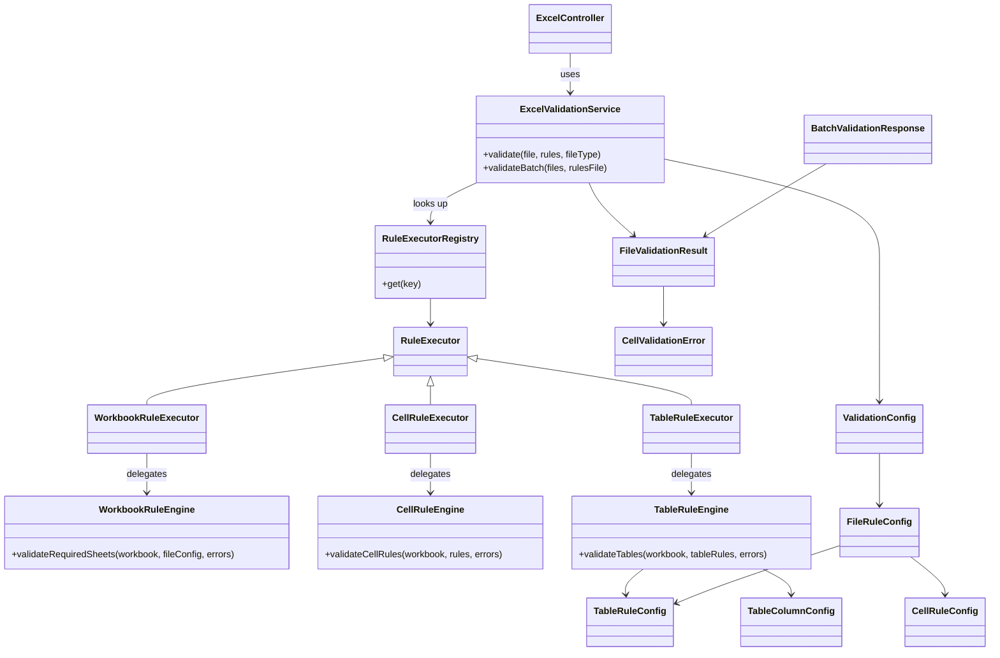

```mermaid
classDiagram
    ExcelController --> ExcelValidationService : uses
    ExcelValidationService --> RuleExecutorRegistry : looks up
    RuleExecutorRegistry --> RuleExecutor
    RuleExecutor <|-- WorkbookRuleExecutor
    RuleExecutor <|-- CellRuleExecutor
    RuleExecutor <|-- TableRuleExecutor
    WorkbookRuleExecutor --> WorkbookRuleEngine : delegates
    CellRuleExecutor --> CellRuleEngine : delegates
    TableRuleExecutor --> TableRuleEngine : delegates
    TableRuleEngine --> TableRuleConfig
    TableRuleEngine --> TableColumnConfig
    ExcelValidationService --> ValidationConfig
    ValidationConfig --> FileRuleConfig
    FileRuleConfig --> CellRuleConfig
    FileRuleConfig --> TableRuleConfig
    ExcelValidationService --> FileValidationResult
    FileValidationResult --> CellValidationError
    BatchValidationResponse --> FileValidationResult

    class ExcelValidationService{
        +validate(file, rules, fileType)
        +validateBatch(files, rulesFile)
    }

    class RuleExecutorRegistry{
        +get(key)
    }

    class CellRuleEngine{
        +validateCellRules(workbook, rules, errors)
    }

    class TableRuleEngine{
        +validateTables(workbook, tableRules, errors)
    }

    class WorkbookRuleEngine{
        +validateRequiredSheets(workbook, fileConfig, errors)
    }
```
