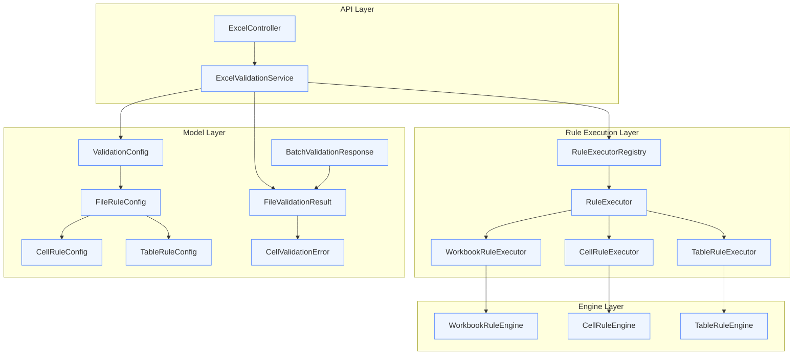

```mermaid
graph TD
    subgraph API Layer
        A[ExcelController] --> B[ExcelValidationService]
    end

    subgraph Rule Execution Layer
        B --> C[RuleExecutorRegistry]
        C --> D[RuleExecutor]
        D --> E[WorkbookRuleExecutor]
        D --> F[CellRuleExecutor]
        D --> G[TableRuleExecutor]
    end

    subgraph Engine Layer
        E --> H[WorkbookRuleEngine]
        F --> I[CellRuleEngine]
        G --> J[TableRuleEngine]
    end

    subgraph Model Layer
        B --> K[ValidationConfig]
        K --> L[FileRuleConfig]
        L --> M[CellRuleConfig]
        L --> N[TableRuleConfig]
        B --> O[FileValidationResult]
        O --> P[CellValidationError]
        Q[BatchValidationResponse] --> O
    end

    classDef layer fill:#eef5ff,stroke:#5b8cff,stroke-width:1px;
    class A,B,C,D,E,F,G,H,I,J,K,L,M,N,O,P,Q layer;
```
