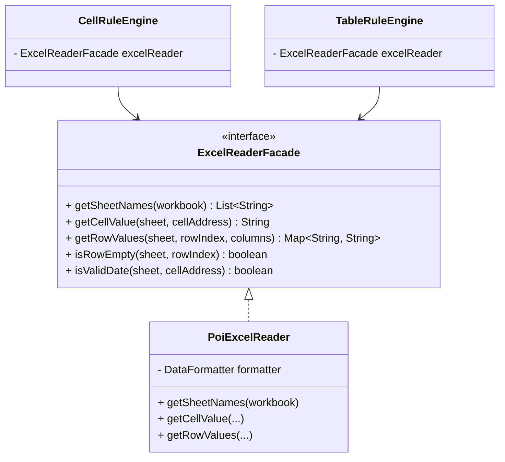

# Excel Validation Application Design

This document outlines the class structure and design patterns used in the Excel Validation service, along with the design for reading Excel files.

## 1. Class Diagram

This class diagram illustrates the relationships between controllers, services, engines, rule executors, and configuration models.

```mermaid
classDiagram
    class ExcelController {
        - ExcelValidationService service
        + validateExcel(excelFile, rulesFile, fileType)
        + validateBatch(excelFiles, rulesFile)
    }

    class ExcelValidationService {
        - ObjectMapper mapper
        - RuleExecutorRegistry ruleExecutorRegistry
        + validate(excelFile, rulesFile, fileType)
        + validateBatch(files, rulesFile)
        - findMatchingConfig(config, fileName)
        - validateWorkbook(workbook, fileConfig, fileName)
    }

    class RuleExecutorRegistry {
        - Map~String, RuleExecutor~ executors
        + get(key) Optional~RuleExecutor~
    }

    class RuleExecutor~T~ {
        <<interface>>
        + getKey() String
        + execute(workbook, ruleObject, errors, passedFields)
    }

    class CellRuleExecutor {
        - CellRuleEngine cellRuleEngine
        + getKey() "cellRules"
    }

    class TableRuleExecutor {
        - TableRuleEngine tableRuleEngine
        + getKey() "tableRules"
    }

    class WorkbookRuleExecutor {
        - WorkbookRuleEngine workbookRuleEngine
        + getKey() "requiredSheets"
    }

    class ValidationConfig {
        - List~FileRuleConfig~ files
    }

    class FileRuleConfig {
        - String fileType
        - List~String~ requiredSheets
        - List~CellRuleConfig~ cellRules
        - List~TableRuleConfig~ tableRules
    }

    class CellRuleConfig {
        - String sheet
        - String cell
        - String fieldName
        - String validationType
    }

    class TableRuleConfig {
        - String sheet
        - String tableName
        - Integer startRow
        - List~TableColumnConfig~ columns
        - List~RowValidationRuleConfig~ rowValidationRules
    }

    ExcelController --> ExcelValidationService
    ExcelValidationService --> RuleExecutorRegistry
    ExcelValidationService --> ValidationConfig
    ValidationConfig *-- FileRuleConfig
    FileRuleConfig *-- CellRuleConfig
    FileRuleConfig *-- TableRuleConfig
    
    RuleExecutorRegistry *-- RuleExecutor
    RuleExecutor <|.. CellRuleExecutor
    RuleExecutor <|.. TableRuleExecutor
    RuleExecutor <|.. WorkbookRuleExecutor
```

---

## 2. Validation Service Design

The validation service is designed using a **Registry and Strategy Pattern** to decouple the core validation logic from the specific types of rules being executed.

### Core Components
1. **`ExcelValidationService` (The Orchestrator):** 
   - Responsible for receiving the uploaded files, parsing the JSON configuration, and matching the uploaded file to the correct `FileRuleConfig` using filename matching.
   - It iterates over the registered executors and passes the `Workbook` and the relevant rule subset (e.g., cell rules, table rules) to each executor.
   - Aggregates the results into a unified `FileValidationResult`.

2. **`RuleExecutorRegistry`:**
   - A Spring component that automatically collects all beans implementing the `RuleExecutor<T>` interface.
   - Allows the `ExcelValidationService` to request an executor by its key (e.g., `"cellRules"`, `"tableRules"`, `"requiredSheets"`).
   - This makes the system highly extensible. Adding a new rule type (e.g., "chartRules") only requires creating a new `ChartRuleExecutor` bean.

3. **`RuleExecutor` & Engines:**
   - Executors act as adapters that map a section of the `FileRuleConfig` to a specific Engine.
   - **`WorkbookRuleEngine`:** Validates workbook-level constraints (e.g., checking if required sheets exist).
   - **`CellRuleEngine`:** Validates absolute cell references (e.g., checking if cell `B2` on sheet `TestSpecification` has a value).
   - **`TableRuleEngine`:** Validates dynamic grid data. It scans rows starting from a specified index, extracts values by column mapping, and applies conditional logic (like dependencies and group headers).

### Validation Flow
1. **Parse Rules:** JSON config is deserialized into `ValidationConfig`.
2. **Match Config:** The uploaded file's base name is matched against the `fileType` in the configs.
3. **Execute:** The service retrieves `RuleExecutor`s from the registry and invokes `execute()`.
4. **Collect:** Passed and failed checks are accumulated in `CellValidationResults` lists.
5. **Report:** Results are packaged into a structured response (e.g., `BatchValidationResponse`) for the frontend.

---

## 3. Excel Utility Reader Design

Currently, the application uses **Apache POI** directly within the engine classes (`CellRuleEngine`, `TableRuleEngine`). 

To improve testability and maintainability, a dedicated **Excel Utility Reader** (Facade) design is recommended. This abstracts the low-level Apache POI calls (like `CellReference`, `Row.MissingCellPolicy`, and `DataFormatter`) behind a clean interface.

### Proposed Architecture

### Design Benefits
1. **Encapsulation:** The messy details of Apache POI (`DataFormatter`, handling null cells, converting column letters to indices) are hidden inside `PoiExcelReader`.
2. **Safety:** The reader can provide safe defaults, such as automatically returning `""` for null cells instead of throwing `NullPointerExceptions`.
3. **Testability:** You can easily mock `ExcelReaderFacade` in your unit tests for `CellRuleEngine` and `TableRuleEngine` without needing to construct actual Apache POI `Workbook` objects.
4. **Performance:** If large files become an issue, you can implement an `EventModelExcelReader` (using POI's SAX parser) that implements the same `ExcelReaderFacade` interface without changing your validation logic.

### Utility Methods Needed
- `stripExcelExtension(String filename)`: Normalizes filenames for configuration matching.
- `columnToIndex(String columnLetter)`: Converts "A" to 0, "B" to 1.
- `extractCellValueSafe(Cell cell)`: Trims whitespace, handles dates, numbers, and text uniformly.

The Release Document Validation Tool is an automation system designed to validate the completeness of Release Notes and Test Specification/Result Excel documents before they are submitted for review or release.

The purpose of the tool is to eliminate manual document verification by automatically checking whether required fields, sections, and checklist items contain the necessary information. The system will analyze uploaded Excel files, validate predefined fields based on configurable validation rules, and generate a detailed validation report identifying missing or incomplete entries.

The tool will support multiple document templates, including Release Notes and Test Specification/Result files. Validation rules will be maintained through a configuration file, allowing administrators to add, modify, or remove required checks without changing the source code. This approach improves maintainability, reduces human error, and ensures that release-related documents meet the required quality and documentation standards before approval and distribution.

Key Features
Upload and validate Release Notes and Test Specification/Result Excel files.

Verify the presence of required information in predefined cells and table sections.

Detect missing, blank, or incomplete required fields.

Generate detailed validation results with pass and fail statuses.

Display overall validation statistics and summaries.

Support configurable validation rules through external JSON configuration files.

Provide clear error messages to help users quickly identify and correct documentation issues.

Expected Benefits
Reduces time spent on manual document reviews.

Improves consistency and accuracy of release documentation.

Minimizes the risk of incomplete releases caused by missing information.

Provides transparency and standardization in document validation processes.

Enables easy maintenance and expansion of validation rules without code changes.

Project Objective
To develop a configurable Excel document validation tool that automatically verifies the completeness of Release Notes and Test Specification/Result documents, ensuring that all required information is properly provided before the documents proceed to the review, approval, and release stages.